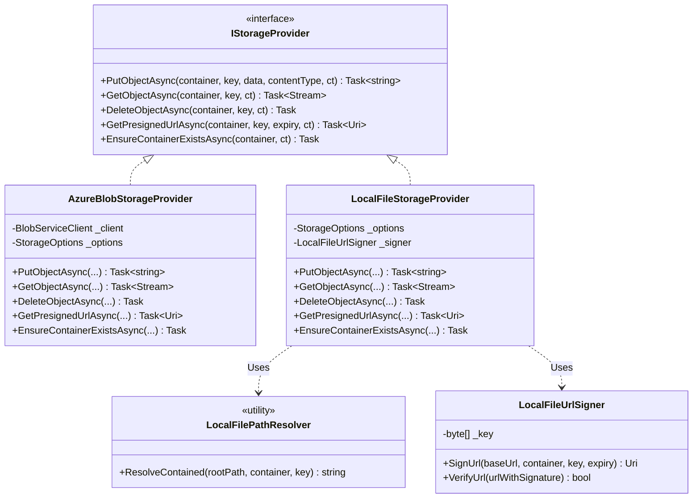
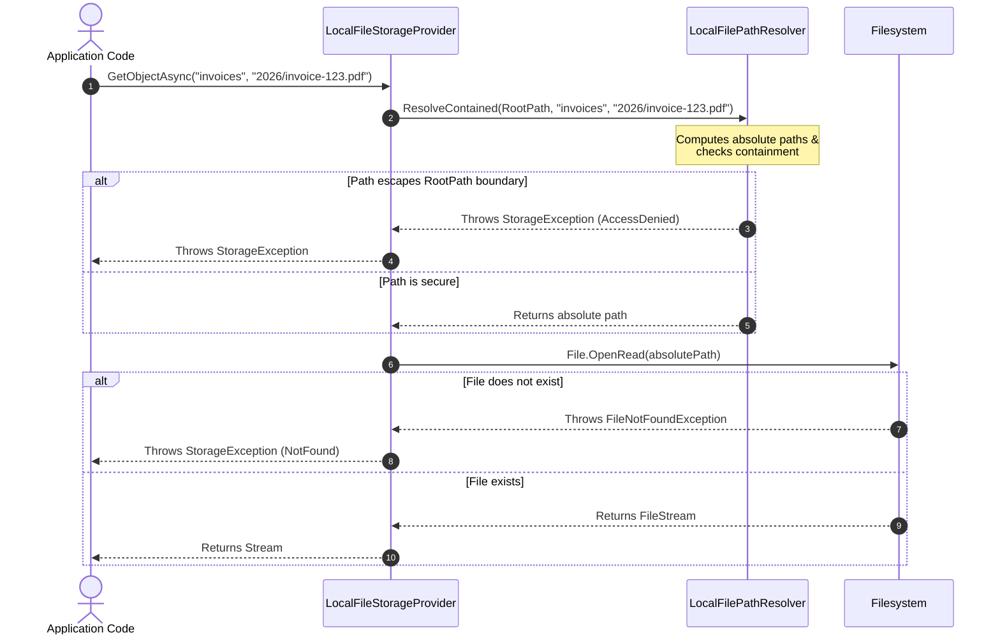

# Storage.Vector Software Architecture Document

This document describes the software architecture, component design, and integration workflows of the `Storage.Vector` library.

---

## 1. Architectural Goals

`Storage.Vector` was designed around three core principles:
1. **Portability**: Maintain zero dependencies on ASP.NET Core hosting models or application-specific business logic, relying only on standard `.NET Core` and `Microsoft.Extensions` abstractions.
2. **Security**: Centralize path traversal defenses directly inside the filesystem provider to prevent directory breakout attacks.
3. **Flexibility**: Allow developers to inject multiple, independent storage backends (e.g., a primary local filesystem and a secondary cloud backup) and configure them cleanly.

---

## 2. Component Design & Class Structure

The library is organized into three primary layers:
- **Abstractions**: Defines the storage contract (`IStorageProvider`) and error model (`StorageException`).
- **Implementations**: Concrete providers for filesystem and cloud storage.
- **Dependency Injection**: Registration glue that parses configuration, executes boot-time options validation, and handles keyed DI resolution.

### Component Diagram (Mermaid)



---

## 3. Detailed Component Descriptions

### A. Abstractions
- **`IStorageProvider`**: The unified interface for uploading, downloading, deleting, and presigning objects. It hides the underlying directory structure or storage account details from callers.
- **`StorageException` & `StorageErrorKind`**: Direct exceptions from Azure SDK (e.g. `RequestFailedException`) or filesystem I/O (e.g. `UnauthorizedAccessException`, `FileNotFoundException`) are caught and translated into `StorageException` with a standard `StorageErrorKind` (e.g. `NotFound`, `AccessDenied`, `Transient`, `Unknown`).

### B. Local Filesystem Components
- **`LocalFileStorageProvider`**: Manages reading and writing files under a defined root path. It delegates file-path resolution and signature generations to sub-components.
- **`LocalFilePathResolver`**: Implements path-traversal containment checks. It resolves a container and key relative to the configured root path, calls `Path.GetFullPath`, and verifies that the resolved path starts with the expected base directory.
- **`LocalFileUrlSigner`**: Signs download URLs using HMAC-SHA256 with a configured private key, incorporating expiration timestamps. It validates incoming request URLs by recalculating the HMAC signature.

### C. Azure Blob Storage Components
- **`AzureBlobStorageProvider`**: Wraps the Azure SDK's `BlobServiceClient`. It handles blob operations, handles Azure SAS token generation for presigned URLs, and maps Azure's custom HTTP errors to `StorageException` models.

---

## 4. Key Workflows & Control Flows

### LocalFile Read Workflow (with Containment Check)
The following sequence diagram shows the step-by-step resolution, containment validation, and file retrieval during a read operation:



---

## 5. Dependency Injection Configuration

`StorageServiceCollectionExtensions` handles options binding, boot-time verification, and dependency resolution.

### Primary Registration
When `AddStorageProvider(configuration)` is invoked, it reads `Storage:Provider` (e.g., `"LocalFile"` or `"AzureBlob"`):
1. Binds the corresponding configuration section to `StorageOptions`.
2. Validates parameters at application boot (`ValidateOnStart()`), verifying connection strings or folder configurations are present before accepting connections.
3. Registers the matched implementation as a Singleton under `IStorageProvider`.

### Keyed Secondary Registration (Backup Mirroring)
To support backup sync paths, `AddSecondaryStorageProvider(configuration)` reads `Storage:Secondary:Provider`:
1. Binds options under `Storage:Secondary` into `SecondaryStorageOptions`.
2. Adapts `SecondaryStorageOptions` to the primary constructor parameter shape via `ToPrimaryShapedOptions(secondaryOptions)` at registration.
3. Registers the provider as a keyed singleton using `AddKeyedSingleton<IStorageProvider>("secondary")` (aliased by the `SecondaryProviderKey` constant).

```mermaid
graph TD
    Config[Configuration Provider] -->|AddStorageProvider| PrimarySelect{Provider?}
    PrimarySelect -->|LocalFile| LocalProv[LocalFileStorageProvider]
    PrimarySelect -->|AzureBlob| AzureProv[AzureBlobStorageProvider]
    LocalProv -->|Register| DI[DI Container: IStorageProvider]
    AzureProv -->|Register| DI

    Config -->|AddSecondaryStorageProvider| SecSelect{Secondary Provider?}
    SecSelect -->|LocalFile| SecLocal[LocalFileStorageProvider]
    SecSelect -->|AzureBlob| SecAzure[AzureBlobStorageProvider]
    SecLocal -->|Map Options| KeyedDI[DI Container: Keyed "secondary"]
    SecAzure -->|Map Options| KeyedDI
```
