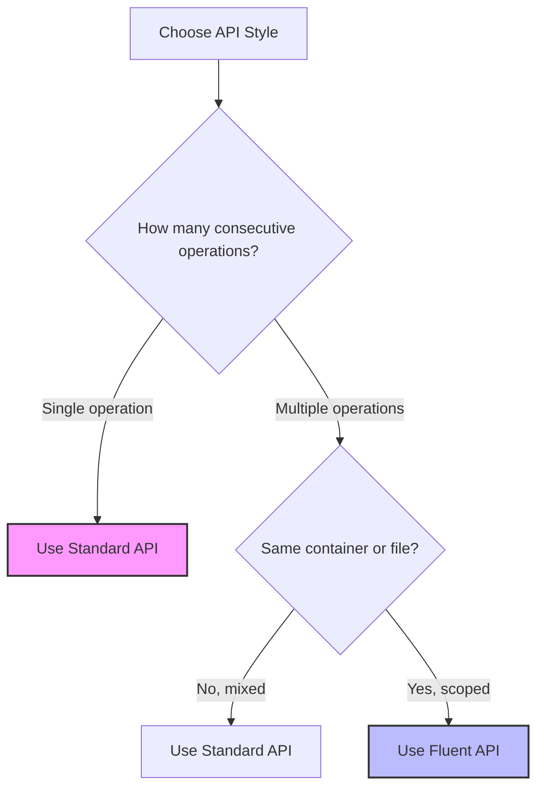

# Guide: Standard vs. Fluent APIs in Storage.Vector

This document compares the traditional flat interface (`IStorageProvider`) with the fluent scoped interface (`IStorageContainer` and `IStorageObject`), outlining their pros, cons, and appropriate usage scenarios.

---

## 1. Comparison Matrix

| Criteria | Standard API (`IStorageProvider`) | Fluent API (`IStorageContainer` / `IStorageObject`) |
| :--- | :--- | :--- |
| **API Style** | Stateless, direct, flat method calls | Scoped, builder-like stateful chains |
| **Parameter Overhead** | High (must pass `container` and `key` for every call) | Low (scoped context is stored on the wrapper object/struct) |
| **Code Readability** | Good for single, isolated actions | Excellent for sequences or container-bounded operations |
| **Resource Allocations** | Zero overhead (direct method invocation) | Zero heap overhead (uses stack-allocated `readonly struct`), minor stack copying |
| **Interface Mocking** | Simple (only mock `IStorageProvider`) | Requires nesting (mocking container/file resolves or utilizing structs directly) |
| **DI Scope Isolation** | Access to all containers and keys | Can pass scoped container contexts directly to lower-level services |

---

## 2. Detailed Trade-Offs

### Standard API (`IStorageProvider`)

#### Pros
* **Zero Overhead**: Direct method calls without creating intermediate wrappers.
* **Maximum Simplicity**: Best suited for simple, one-off utility scripts or simple controllers that only execute a single download or delete.
* **Trivial Testing**: Mocking a single interface containing pure methods is straightforward in unit tests.

#### Cons
* **Parameter Pollution**: Downstream helper methods that process multiple files inside the same directory must constantly carry `string container` through their parameters.
* **Prone to Typos**: High risk of swapping `container` and `key` arguments, or passing incorrect container string names to different methods.

---

### Fluent API (`IStorageContainer` & `IStorageObject`)

#### Pros
* **Encapsulation of Context**: Scopes a container or file context to a local variable. You can pass an `IStorageContainer` to a repository or service, restricting its access to only that folder.
* **Improved Ergonomics**: Eliminates redundant string parameters, resulting in clean, self-documenting code.
* **Per-Object Context Preservation**: Allows future extension blocks like metadata, headers, or permissions to be built directly into the file context before execution.

#### Cons
* **API Surface Expansion**: Adds more interfaces and types, increasing the surface area for developers to learn.
* **Nesting Complexity in Tests**: Writing unit tests for services using fluent interfaces requires either mocking the fluid chain (`Setup(x => x.Container(...).File(...).UploadAsync(...))`) or utilizing the concrete structs `StorageContainer` and `StorageObject`.

---

## 3. When to Use Which



### Choose the **Standard API** when:
1. **Executing single operations**: For example, a file download controller endpoint that matches a key to a stream and returns it:
   ```csharp
   // Standard API is cleanest here
   return File(await storage.GetObjectAsync("invoices", key, ct), "application/pdf");
   ```
2. **Bulk loading across different containers**: Doing migrations or syncing files across varying containers where keeping state is unnecessary.
3. **Optimizing for minimal stack manipulation**: In performance-critical hotpaths where even minor struct copies are undesirable.

### Choose the **Fluent API** when:
1. **Running sequential operations on the same object**: For example, verifying a container exists, writing a file, and then generating a presigned URL:
   ```csharp
   var file = storage.Container("invoices").File("2026-07.pdf");
   await file.Container.EnsureExistsAsync(ct);
   await file.UploadAsync(dataStream, "application/pdf", ct);
   var url = await file.GetPresignedUrlAsync(TimeSpan.FromMinutes(10), ct);
   ```
2. **Injecting scoped access into business logic**: Instead of giving a service full access to all storage containers, pass only a specific container:
   ```csharp
   public class InvoiceProcessor(IStorageContainer invoiceContainer)
   {
       public async Task SaveAsync(string invoiceId, Stream data) =>
           await invoiceContainer.File($"{invoiceId}.pdf").UploadAsync(data, "application/pdf");
   }
   ```
